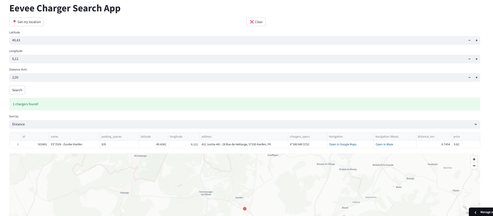

# Purpose

This app is made to search for the charging stations around you or around a specific location.
The visible charging stations are within the EEVEE network only.
The user can search in a maximum distance of 10 km (otherwise, the app would take too much time to search)
The user can search by distance or by price, and see the technology, the availability and power of the charging stations.

# Run locally

'''streamlit run src/app.py'''

# Deployment

This app is deployed publicly at eeveechargingmap.streamlit.app
Thanks to Streamlit community cloud

# Devices

This app can be used on laptops or phones, but it has been thought to be used by phones

# Authentication

The login/passwords are shared to users asking for it. Send a demand to allagonnepro@gmail.com

# Geolocation

The geolocation feature requires the user to allow location search from your laptop or phone.

# Screenshot

